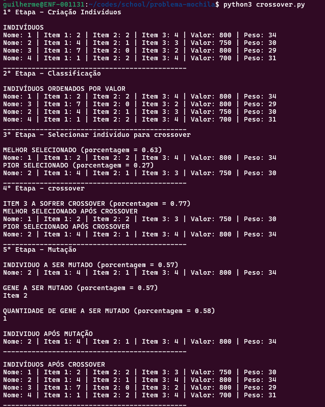
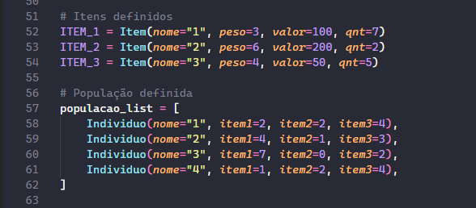

# Problema-mochila

- Python >= 3.11

Exercício para Faculdade de Ciência da Computação, 5º semestre, disciplina de Inteligência Artificial. Guilherme de Mazzi Viçozo - G42366

### Setup

Para rodar o programa, basta executar o script 'crossover.py':
- Linux:
    ```
    python3 crossover.py
    ```

- Windows:
    ```
    py crossover.py
    ```

O programa vai rodar com todos os prints de cada etapa do processo.


Para modificar os indivíduos e os items, para receber outros resultados, basta modifica-los dentro do código:

